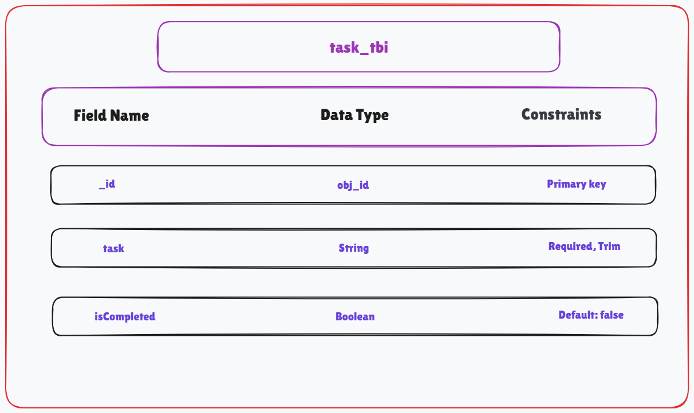

## Database Configuration & Setup

### Database Choice & Justification
For this task management system, we chose **MongoDB** coupled with **Mongoose** as our Object Data Modeling (ODM) layer. A document-based NoSQL database provides the flexibility needed for handling task data structures efficiently without requiring heavy SQL tables or multi-table joins. Mongoose allows us to keep our schema clean, enforce type safety (`String`, `Boolean`), and perform efficient server-side text matching via native regular expressions.

### Schema Structure
Our database tracks tasks using the `task_tbi` collection based on the following model structure:
- `task`: (String, Required, Trimmed) The description text of the task.
- `isCompleted`: (Boolean, Default: false) Tracks execution progress.

### Schema Diagram


### Set up the Database

1. **Install Project Dependencies:**
   ```bash
   npm install

